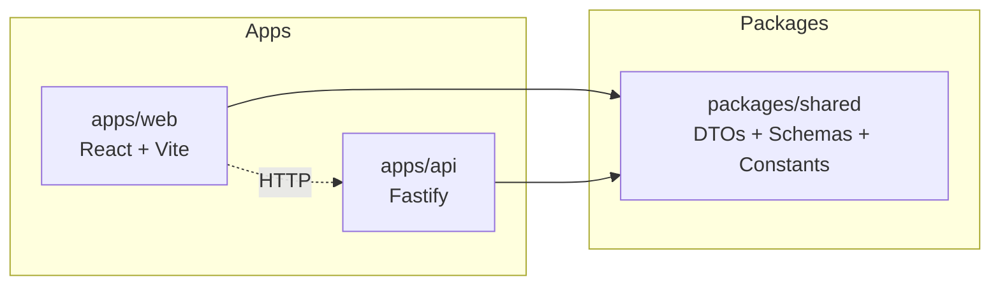

# Ronaldo Monorepo

A TypeScript monorepo template for a quiz platform with a React frontend, Fastify backend, and shared domain package.

## Local setup

1. Install dependencies:
   ```bash
   npm install
   ```
2. Initialize Git hooks:
   ```bash
   npm run prepare
   ```
3. Start the frontend:
   ```bash
   npm run dev
   ```
4. Start the API in another terminal:
   ```bash
   npm run dev --workspace @ronaldo/api
   ```

## Scripts

### Root

- `npm run build` — build all workspaces in dependency order.
- `npm run lint` — run ESLint across the monorepo.
- `npm run typecheck` — run TypeScript project references build (`tsc -b`).
- `npm run format` — auto-format with Prettier.
- `npm run format:check` — verify formatting.

### Workspace examples

- `npm run build --workspace @ronaldo/shared`
- `npm run build --workspace @ronaldo/api`
- `npm run build --workspace @ronaldo/web`

## Architecture diagram



## Contribution conventions

- Use workspace-scoped scripts for package-specific work.
- Keep shared contracts in `packages/shared` and consume them from apps.
- Ensure commits pass lint, typecheck, and build before opening PRs.
- Pre-commit hook runs `lint-staged` to auto-format staged files.

## Tooling included

- **ESLint** with TypeScript + React hooks support.
- **Prettier** for formatting.
- **TypeScript project references** for incremental builds and package boundaries.
- **Husky + lint-staged** for commit hooks.
- **GitHub Actions CI** for lint, typecheck, and build validation.
