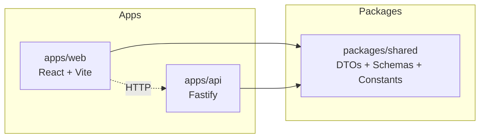

# Ronaldo Monorepo

A TypeScript monorepo template for a quiz platform with a React frontend, Fastify backend, and shared domain package.

## Local setup

1. Install dependencies:
   ```bash
   npm install
   ```
2. Initialize Git hooks:
   ```bash
   npm run prepare
   ```
3. Start the frontend:
   ```bash
   npm run dev
   ```
4. Start the API in another terminal:

   ```bash
   npm run dev --workspace @ronaldo/api
   ```

5. (Optional) if API is on another host/port set web API origin:
   ```bash
   VITE_API_ORIGIN=http://localhost:4000 npm run dev
   ```

## Fully isolated / portable setup (no local Node install)

If you want to keep your host machine clean, run the project in containers.

### Option 1: Docker Compose (recommended)

Prerequisite: a container runtime (Docker Desktop, Rancher Desktop, Podman Desktop).

1. Start both frontend and API:
   ```bash
   docker compose up
   ```
2. Open:
   - Frontend: `http://localhost:5173`
   - API health: `http://localhost:4000/api/v1/health`

   > Uwaga: API używa prefiksu `/api/v1`.

3. Stop containers:
   ```bash
   docker compose down
   ```

Notes:

- Dependencies are installed inside the containers (`npm install` runs in container startup).
- Your host only needs the container runtime and the repository files.

### Option 2: Cloud dev environments

If you want zero local installs at all, use a cloud workspace (for example GitHub Codespaces) and run the same npm scripts there.

### Option 3: Bez Dockera i bez instalacji Node (Windows, darmowe)

Jeśli nie chcesz używać Dockera i nadal chcesz mieć "czysty" system, użyj skryptu portable:

1. Uruchom PowerShell w katalogu projektu i wykonaj:
   ```powershell
   .\scripts\portable-dev.ps1
   ```
2. Skrypt automatycznie:
   - pobiera portable Node.js ZIP do folderu `.portable/`,
   - uruchamia `npm install`,
   - buduje `@ronaldo/shared` (wymagane przez Vite),
   - startuje API i frontend.
3. Otwórz:
   - Frontend: `http://localhost:5173`
   - API health: `http://localhost:4000/api/v1/health`

Uwagi:

- API używa prefiksu `/api/v1` (np. `/api/v1/health`).

- Nic nie instaluje się globalnie w Windows (poza tym, że potrzebujesz PowerShell i dostępu do Internetu).
- Aby usunąć całe środowisko portable, skasuj folder `.portable/` i `node_modules/`.
- Możesz wybrać inną wersję Node:

  ```powershell
  .\scripts\portable-dev.ps1 -NodeVersion 22.14.0
  ```

- Jeśli zobaczysz błąd `node is not recognized` podczas `npm install`, uruchom ponownie skrypt — nowa wersja wymusza użycie portable Node przez `PATH` i `npm_config_scripts_prepend_node_path`.
- Jeśli trafisz na `EPERM` przy usuwaniu `node_modules`, zamknij edytor/terminale używające projektu, usuń `node_modules/` ręcznie i uruchom skrypt ponownie.
- Jeśli zobaczysz błąd Vite `Failed to resolve entry for package "@ronaldo/shared"`, uruchom skrypt ponownie albo ręcznie: `./.portable/node-v22.14.0-win-x64/npm.cmd run build --workspace @ronaldo/shared`.

## Scripts

### Root

- `npm run build` — build all workspaces in dependency order.
- `npm run lint` — run ESLint across the monorepo.
- `npm run typecheck` — run TypeScript project references build (`tsc -b`).
- `npm run format` — auto-format with Prettier.
- `npm run format:check` — verify formatting.

### Workspace examples

- `npm run build --workspace @ronaldo/shared`
- `npm run build --workspace @ronaldo/api`
- `npm run build --workspace @ronaldo/web`

## Architecture diagram



## Contribution conventions

- Use workspace-scoped scripts for package-specific work.
- Keep shared contracts in `packages/shared` and consume them from apps.
- Ensure commits pass lint, typecheck, and build before opening PRs.
- Pre-commit hook runs `lint-staged` to auto-format staged files.

## Tooling included

- **ESLint** with TypeScript + React hooks support.
- **Prettier** for formatting.
- **TypeScript project references** for incremental builds and package boundaries.
- **Husky + lint-staged** for commit hooks.
- **GitHub Actions CI** for lint, typecheck, and build validation.
